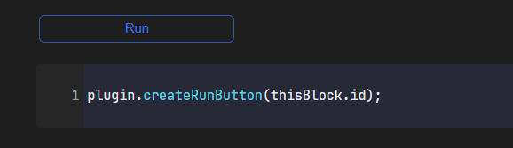
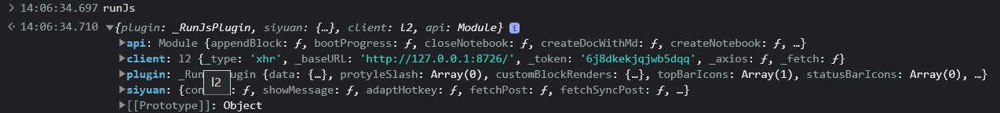

The purpose of this plugin is to extend the capabilities of the plugin to the global scope, making it easier for users to develop "micro-plugins" within SiYuan to enhance its functionality.

> [!TIP]
> In response to a user's [suggestion](https://github.com/frostime/sy-run-js/issues/13), we have created a [discussion forum](https://github.com/frostime/sy-run-js/discussions) on GitHub for this project. We welcome everyone to share their JavaScript code there.


## Run a Code Block

### Basic Usage

1. Create a JavaScript code block.
2. Click on "Block Menu -> Run JS -> Run Code".
3. The plugin will automatically execute the code within the code block.

In addition, you can also run JS code blocks using keyboard shortcuts. Simply place the cursor inside the code block and press `alt + F5` to run the current code block.

Here is a sample test case:

```js
console.log(siyuan);
console.log(plugin);
console.log(client);
console.log(thisBlock);
async function main() {
    const response = await client.pushMsg({
      msg: "This is a notification message",
      timeout: 7000,
    });
    console.log(response);
}
main();
plugin.saveAction(thisBlock.id, "Test Code");
```

In the plugin code block environment, several accessible objects are available:

* `siyuan`: The `siyuan` module of the plugin.
* `plugin`: The `this` object of the RunJs plugin.
* `thisBlock`: The block object of the current code block.
* `client`: An instance of `client` from [@siyuan-community/siyuan-sdk](https://github.com/siyuan-community/siyuan-sdk/tree/main/node).
* `api`: An object that encapsulates some core API functions, see [plugin-sample-vite](https://github.com/frostime/plugin-sample-vite/blob/main/src/api.ts).
* `args`: The list of parameters passed when calling `plugin.call`, which is an empty list `[]` during normal execution of the code block.

### External APIs

The following APIs can be called directly through the `plugin` object.

* `runCodeBlock`

  ```ts
  public runCodeBlock(id: BlockId)
  ```
  Run a JavaScript block with the given ID.

* `runJsCode`

  ```ts
  public async runJsCode(code: string): Promise<any>
  ```

  Run code asynchronously.
* `runJsCodeAsync`

  Same as `runJsCode`.
* `runJsCodeSync`

  ```ts
  public runJsCodeSync(code: string): any
  ```

  Run code synchronously.


## Registering Code Blocks to the Top Bar

To add the current block to the top bar for quick access, follow these steps: 

1. Click on "Block Menu" -> "Run JS" -> "Add to Top Bar".
2. Before adding it to the top bar, make sure to set the name of the code block.

The following APIs can be called directly through the `plugin` object.

* `saveAction`

  ```ts
  public saveAction(blockId: BlockId, title?: string, sort?: number)
  ```

  Save the code block with the specified `blockId`. The saved action can be triggered quickly through the top bar menu button.

  - `blockId`: The ID of the specified code block.
  - `title`: The title of the action. If left empty, the block name will be used. If the name is empty, the block ID will be used.
  - `sort`: Sorting order.

* `removeAction`

  ```ts
  public removeAction(blockId: BlockId)
  ```

  Remove the action.


## Registering Code Blocks as Callable Methods

Sometimes, users may want their code blocks to be callable methods that can be used by other code blocks. In the plugin, you can use the `plugin.call(<name>)` syntax to call other code blocks as functions.

```js
plugin.call("Func", "args1", "args2");
```

To register a code block as a callable "function", follow these steps:

1. Create a new code block:

    ```js
    siyuan.showMessage(`${args[0]} say ${args[1]}`);
    return 'ok!';
    ```

    Note the use of `args`, which will be an array of parameters passed when calling the function.

2. Set the name of the code block as `Func`.
3. Save it as a callable method.
4. Call the `Func` function using the following format:

    ```js
    const main = async () => {
        let ans = await plugin.call('Func', 'I', 'hello');
        siyuan.showMessage("Return" + ans, 5000);
    }
    main();
    ```

The following API can be called directly through the `plugin` object:

```ts
public async call(callableId: string, ...args: any[]): Promise<any>
```

## Registering Code Blocks as a Button

- By clicking on the code block menu and selecting "Create Button", you can create a button for a specific code block.
- The default title of the button is the name of the block; if the block is unnamed, the title is "Run".

> ⚠️ Caution: Please first enable "Allow execution of scripts within HTML blocks" in SiYuan's "Settings" - "Editor", otherwise the button script will not trigger.


This functionality can be invoked through the following API call:

```ts
public async createRunButton(id: BlockId, title?: string)
```




## `globalThis.runJs`

For greater flexibility, this plugin exposes a `runJs` object in the global scope. You can directly access the `runJs` object in the console, which contains all the objects exposed to code blocks (except `args` and `thisBlock`).



With the `runJs` object, you can even use it in SiYuan's built-in code snippets to automatically execute certain functionalities when SiYuan starts. Here's an example that you can try by placing it in SiYuan's settings under "Appearance" -> "Code Snippets" -> "JS":

```js
runJs.siyuan.showMessage('Hello from code snippet!', 3000);
```

This will display a message in SiYuan for 3 seconds when SiYuan starts.

Note: The `runJs` object is not available for use within code blocks. It is meant for use in SiYuan's built-in code snippets and the console.

```js
const waitForRunJs = async (maxAttempts) => {
  let attempts = 0;

  while (attempts < maxAttempts) {
    if (globalThis?.runJs !== undefined) {
      console.debug("Detect runJS!");
      return true;
    }
    await new Promise((resolve) => {
      setTimeout(resolve, 5000);
    });

    attempts++;
  }
  return false;
};

waitForRunJs(5).then((flag) => {
    if (flag === false) return;
    //Your code here...
    runJs.siyuan.showMessage("Hello!");
});
```


## Binding to SiYuan's Event Bus

The `plugin` object of RunJs provides two methods for binding and unbinding event handlers to/from SiYuan's event bus:

* `onEvent`

  ```ts
  public onEvent(event: any, func: (event: CustomEvent<any>) => any)
  ```

* `offEvent`

  ```ts
  public offEvent(event: any)
  ```

These two methods work similarly to the `plugin.eventBus.on` and `off` methods but provide a safer and more convenient way to use them. When calling the `onEvent` method repeatedly, the plugin will automatically unregister the previous event handlers. Additionally, when the plugin is unloaded (`onunload`), it will automatically unregister all event handlers bound using this interface.


## Other APIs

### protyleSlash

```ts
public addProtyleSlash(slash: {
    filter: string[],
    html: string,
    id: string,
    callback(protyle: Protyle): void,
})

public removeProtyleSlash(id: string)
```

This API allows you to add a `/` menu item to your plugin. The `addProtyleSlash` method automatically checks if the `id` is already used.

### `createRunButton`

```ts
public async createRunButton(id: BlockId, title?: string)
```


Pass the ID of the JavaScript block (`id`) and an optional title for the button (`title`).


## Remote Request (🧪 Experimental Feature)

The plugin listens to a broadcast channel named `sy-run-js` in SiYuan.

You can send JS code to the channel through the `/api/broadcast/postMessage` interface, and the plugin will automatically execute the code in the `message`.

```bash
curl --request POST \
  --url http://127.0.0.1:1468/api/broadcast/postMessage \
  --header 'Authorization: Token [Your token here]' \
  --header 'Content-Type: application/json' \
  --data '{
    "channel": "sy-run-js",
    "message": "console.log('\''Yes'\'')"
}'
```

> Note: About Broadcast.
> The Broadcast API is a feature provided internally by SiYuan, allowing internal plugins to connect with SiYuan using WebSocket; e.g., binding a `channel` named sy-run-js, `ws://127.0.0.1:6806/ws/broadcast?channel=sy-run-js`.
> After a plugin has bound to a specific channel, external sources can send messages to the channel by making a Post request to the postMessage web API.

Objects accessible within the code:

- `siyuan`
- `client`
- `api`
- `plugin`
- `ws`: A Proxy object for the WebSocket connection instance that binds the plugin to SiYuan.

  - ⚠️ Note: This is not a WebSocket Server!
- `postMessage: (channel: string, message: any) => void`: An implementation function of the PostMessage API, which is essentially similar to calling `api.request('/api/broadcast/postMessage')`.
