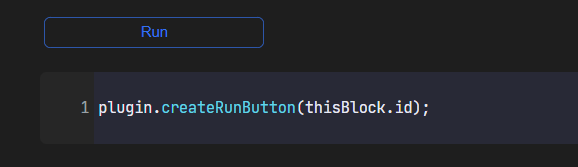

本插件的意义在于，将插件的一些能力扩展到全局，从而方便用户在思源内部就能开发一些「微插件」来增强思源的功能。

## 运行一个代码块

### 基本用法

1. 新建一个 javascript 代码块
2. 点击「块菜单——>Run JS——> 运行代码」
3. 插件将自动运行代码块中的代码

除此之外，插件还可以通过快捷键方式来运行 js 代码块，将光标聚焦在代码块中，然后按 `alt + F5` 即可运行当前的代码块。

以下是一个测试样例：

```js
console.log(siyuan);
console.log(plugin);
console.log(client);
console.log(thisBlock);
async function main() {
    const response = await client.pushMsg({
      msg: "This is a notification message", timeout: 7000,
    });
    console.log(response);
}
main();
plugin.saveAction(thisBlock.id, "Test Code");
```

插件的代码块环境中，提供了若干个可访问的对象：

* `siyuan`: 插件的 `siyuan` module
* `plugin`: RunJs 插件的 `this` 对象
* `thisBlock`: 当前代码块本身的 block 对象
* `client`: 一个 [@siyuan-community/siyuan-sdk](https://github.com/siyuan-community/siyuan-sdk/tree/main/node) 的 `client` 实例
* `api`: 是封装了一部分内核 API 函数的一个对象, 见 [plugin-sample-vite](https://github.com/frostime/plugin-sample-vite/blob/main/src/api.ts)
* `args`: 调用 `plugin.call` 的时候传入的参数列表, 在正常运行代码块时为空列表 `[]`

### 对外 API

以下 API，可以通过 `plugin` 对象直接调用

* `runCodeBlock`

  ```ts
  public runCodeBlock(id: BlockId)
  ```

  传入一个 js 块的 ID，并运行他
* `runJsCode`

  ```ts
  public async runJsCode(code: string): Promise<any>
  ```

  运行代码, 为 `async` 模式
* `runJsCodeAsync`

  同 `runJsCode`
* `runJsCodeSync`

  ```ts
  public runJsCodeSync(code: string): any
  ```

  运行代码, sync 模式


## 将代码块注册到顶栏

点击「块菜单——>Run JS——> 添加到顶栏」，可以将当前的块添加到顶栏按钮中，以方便快速触发。

需要注意，在添加到顶栏之前，需要设置代码块的名称（name）。


以下 API，可以通过 `plugin` 对象直接调用

* `saveAction`

  ```ts
  public saveAction(blockId: BlockId, title?: string, sort?: number)
  ```

  将指定 blockid 的 codeblock 保存, 保存的 action 可以通过顶栏菜单按钮来快速触发

  * blockId: 指定 codeblock 的 id
  * title: 标题, 如果留空，则使用块命名，如果命名为空，使用块 ID
  * sort: 排序

* `removeAction`

  ```ts
  public removeAction(blockId: BlockId)
  ```

  删除 action


## 将代码块注册为可调用的方法

有时候，用户可能希望自己的某个代码块可以作为一个可以被调用的方法，被其他代码块使用。在插件中，可以使用 `plugin.call(<name>)` 的形式将别的代码块作为函数来调用。

```js
plugin.call("Func", "args1", "args2");
```

为了将一个代码块注册为一个可以被调用的“函数”，点击代码块菜单，选择 "保存为可调用方法"。

需要注意，在保存为 可调用方法（Callable）之前，需要设置代码块的名称（name）。

以下是一个示例：

1. 首先新建一个代码块

    ```js
    siyuan.showMessage(`${args[0]} say ${args[1]}`);
    return 'ok!';
    ```

    注意到 `args`, 这个将是调用的时候传入的参数组成的数组.
2. 将代码块命名为 `Func`
3. 保存为可调用的函数
4. 通过以下形式来调用这个 `Func` 函数

    ```js
    const main = async () => {
        let ans = await plugin.call('Func', 'I', 'hello');
        siyuan.showMessage("Return" + ans, 5000);
    }
    main();
    ```


以下 API，可以通过 `plugin` 对象直接调用

```ts
public async call(callableId: string, ...args: any[]): Promise<any>
```


## 创建代码块的触发按钮

- 点击代码块菜单，选择「创建触发按钮」，你可以为指定的代码库创建一个按钮。
- 按钮的默认标题为块的命名；如果块没有命名，则标题为「Run」。

> ⚠️ 注意: 请首先在思源的「设置」-「编辑器」当中开启「允许执行 HTML 块内脚本」，否则按钮脚本将无法触发。




该功能可以通过如下 API 调用：

```ts
public async createRunButton(id: BlockId, title?: string)
```


## `globalThis.runJs`

为了方便更灵活的使用，本插件将一个 `runJs` 对象暴露在全局。你可以直接在控制台中访问 `runJs` 对象，其中包含了暴露给代码块的所有对象（除了 `args` 和 `thisBlock`）。


有了 runJs 对象后，你甚至可以在思源内置的代码片段中使用他，从而在思源启动的时候自动执行一些功能。以下是一个示例，你可以将它放入思源设置的「外观——代码片段——JS」中看看效果。

```js
const waitForRunJs = async (maxAttempts) => {
  let attempts = 0;

  while (attempts < maxAttempts) {
    if (globalThis?.runJs !== undefined) {
      console.debug("Detect runJS!");
      return true;
    }
    await new Promise((resolve) => {
      setTimeout(resolve, 5000);
    });

    attempts++;
  }
  return false;
};

waitForRunJs(5).then((flag) => {
    if (flag === false) return;
    //Your code here...
    runJs.siyuan.showMessage("Hello!");
});
```


## 绑定思源的事件总线

RunJs 的 `plugin` 对外暴露了两个方法，用于绑定和解绑来自思源的总线事件

* `onEvent`

  ```ts
  public onEvent(event: any, func: (event: CustomEvent<any>) => any
  ```
* `offEvent`

  ```ts
  public offEvent(event: any)
  ```

这两个方法和插件的 `plugin.eventBus.on` 还有 `off` 方法用法一致，但是使用起来更加安全。在反复调用 `onEvent` 方法时，插件会自动 `off` 之前的方法，且在插件 `onunload` 的时候也会自动注销所有通过该接口绑定的回调函数。


## 其他 API

### protyleSlash

```ts
public addProtyleSlash(slash: {
    filter: string[],
    html: string,
    id: string,
    callback(protyle: Protyle): void,
})

public removeProtyleSlash(id: string)
```

为插件添加 `/` 功能菜单，`addProtyleSlash` 会自动检查 `id` 是否重复。


## 远程请求（🧪 实验性功能）

插件在思源本地监听了一个 channel 名称为 `sy-run-js` 的 Websocket 信道。

你可以通过思源的 `/api/broadcast/postMessage` 接口，向通道发送 js 代码，插件会自动执行 `message` 中的代码。

```bash
curl --request POST \
  --url http://127.0.0.1:1468/api/broadcast/postMessage \
  --header 'Authorization: Token [Your token here]' \
  --header 'Content-Type: application/json' \
  --data '{
    "channel": "sy-run-js",
    "message": "console.log('\''Yes'\'')"
}'
```
